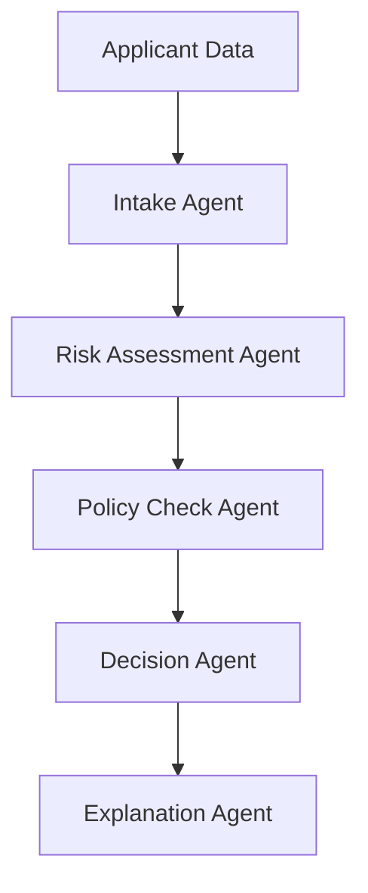

# Agentic AI for Credit Underwriting (FinTech)

This repository provides a **simple, educational reference implementation** of how **agentic AI** can be applied to **credit underwriting** workflows in financial services.

Instead of relying on a single monolithic model, this example demonstrates how **multiple AI agents** can collaborate to assess credit risk, apply policies, and generate explainable decisions — similar to how human underwriting teams operate.

---

## Why Agentic AI for Credit Underwriting?

Traditional underwriting systems are often:
- Rule-heavy and rigid
- Hard to explain to regulators
- Difficult to adapt to new policies or data sources

**Agentic AI** introduces a modular approach where:
- Each agent has a focused responsibility
- Decisions are transparent and auditable
- Human review can be seamlessly integrated

This aligns well with real-world underwriting processes in banks, NBFCs, and FinTech platforms.

---

## High-Level Workflow

1. **Intake Agent**: Validates applicant data and ensures required fields are present.

2. **Risk Assessment Agent**: Evaluates applicant risk using simple scoring logic (mocked for demonstration).

3. **Policy Check Agent**: Applies underwriting rules and flags edge cases.

4. **Decision Agent**: Determines approval, rejection, or manual review.

5. **Explanation Agent**: Generates a human-readable explanation for the decision.

---

## Architecture Overview


This diagram illustrates how multiple specialized AI agents collaborate to produce an explainable credit underwriting decision.

## How to Run This Example

This repository is designed to be simple to run and easy to understand, even for those new to agentic AI concepts.

### Prerequisites

- Python 3.9 or later
- Basic familiarity with running commands in a terminal

### Step 1: Clone the Repository

```bash
git clone https://github.com/KKAzilen/agentic-ai-credit-underwriting.git
cd agentic-ai-credit-underwriting
```

### Step 2: (Optional) Create a Virtual Environment

Using a virtual environment is recommended to keep dependencies isolated.

```bash
python -m venv venv
source venv/bin/activate     # macOS/Linux
venv\Scripts\activate        # Windows
```

### Step 3: Install Dependencies

This example uses only standard Python libraries.
The requirements.txt file is included for future extensibility.

```bash
pip install -r requirements.txt
```

### Step 4: Run the Agentic Underwriting Workflow

Execute the main script to run the agentic AI workflow on sample applicant data.

```bash
python agent.py
```

### Step 5: Review the Output

The script will:

- Process each sample applicant
- Execute the underwriting agents sequentially
- Output the final decision and explanation in the terminal

Example output:

```bash
{'id': 'A001', 'decision': 'Approved', 'explanation': 'The application was approved based on a credit score of 720 and an annual income of 75000.'}
```

---

## Sample Input Data

The repository uses mock applicant data stored in ```sample_applicants.json```.
This avoids regulatory concerns while still demonstrating realistic underwriting logic.

---

## Enterprise Extensions (Conceptual)

In real-world financial systems, this architecture can be extended with:

- ML-based credit scoring models
- External credit bureau integrations
- Fraud detection agents
- Human-in-the-loop review workflows
- Audit logs for regulatory compliance

---

## Related Resources

If you’re exploring how **agentic AI** can be applied to real-world financial services workflows, the following resources provide deeper context and enterprise perspectives:

### Deep Dive: Agentic AI in Credit Underwriting
A detailed exploration of how agent-based AI systems are reshaping credit risk assessment, decision orchestration, and explainability in modern FinTech platforms.

👉 Read the full article:  
[Agentic AI in Credit Underwriting](https://www.azilen.com/blog/agentic-ai-for-credit-underwriting/)

---

### Enterprise AI Agent Development Services
Designing and operationalizing agentic AI systems in regulated environments requires careful attention to scalability, governance, and integration.

Azilen Technologies helps financial institutions and FinTech companies:
- Design multi-agent AI architectures
- Integrate AI agents with existing underwriting systems
- Enable human-in-the-loop decision-making
- Build explainable and auditable AI workflows

👉 Explore Azilen’s AI Agent Development Services:  
[AI Agent Development Services](https://www.azilen.com/ai-agents-development-services/)

---


